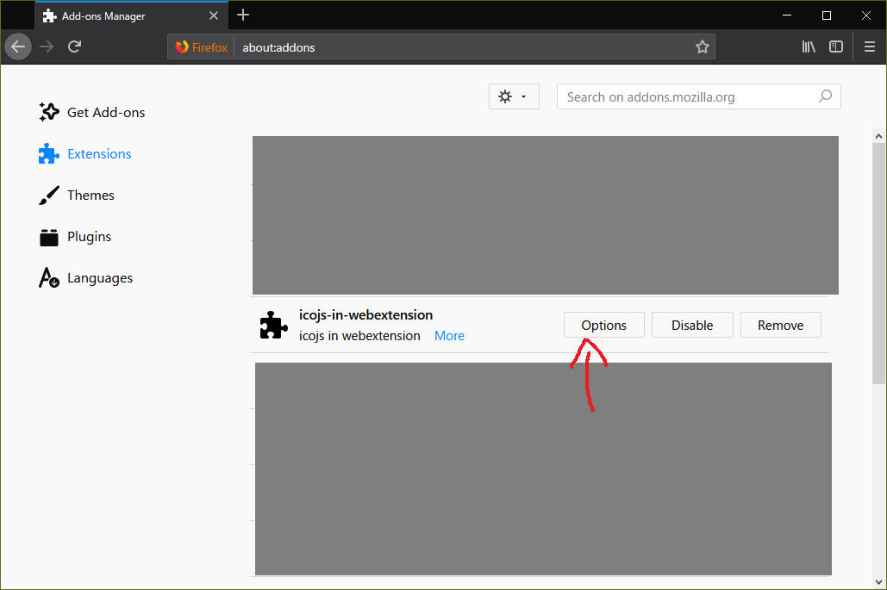

# icojs-in-webextension

Use [icojs](https://github.com/egy186/icojs) in the browser extension.

Ref: https://github.com/egy186/icojs/issues/126

## Usage

1. Download the extension from the [release page](https://github.com/egy186/icojs-in-webextension/releases/latest).
2. Click the menu button and click `Add-ons`.
3. In the Add-ons Manager tab, select `Extensions`.
4. Find `icojs-in-webextension` and click its `Options` button.
5. In the Options tab, input Favicon URL and click `Get icon!` button
